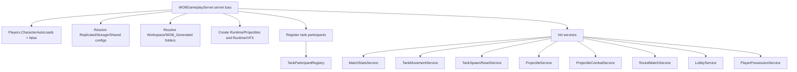
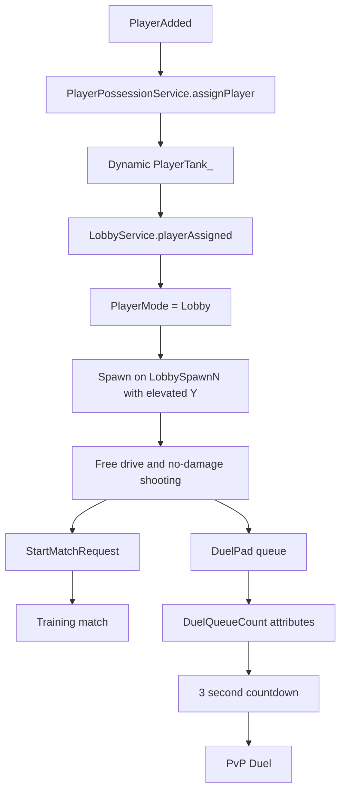
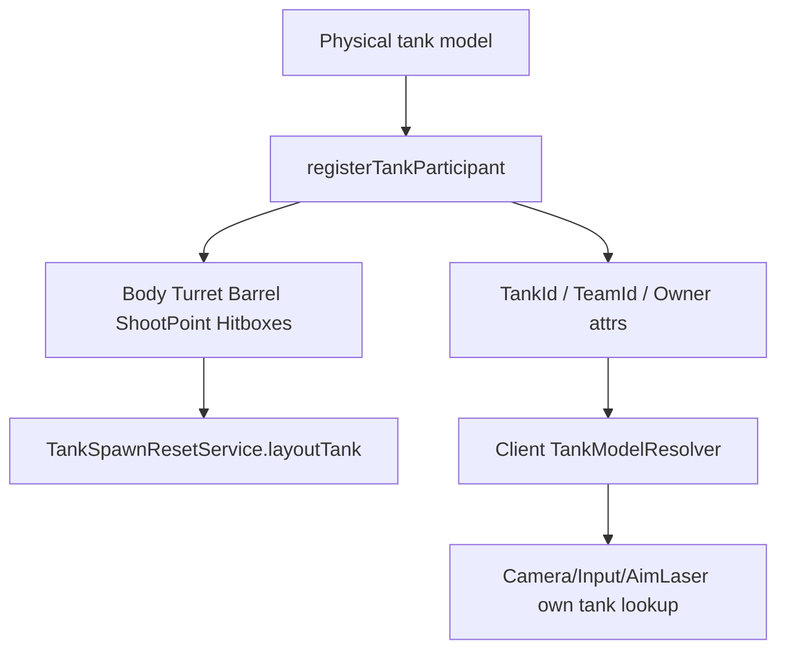
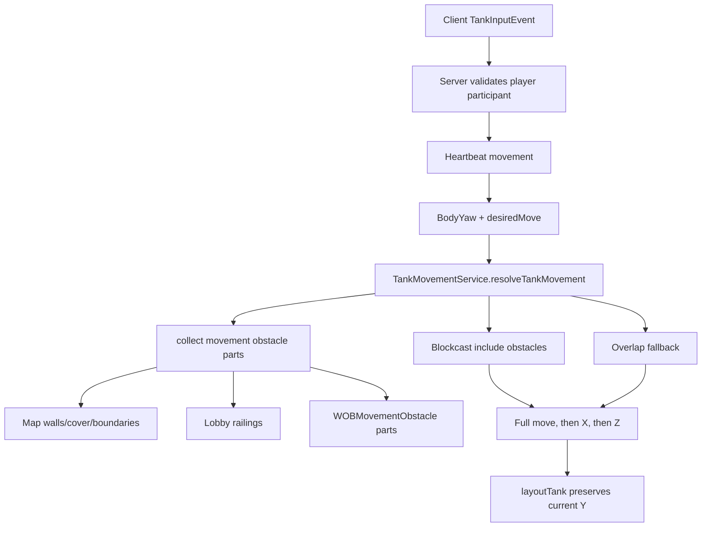
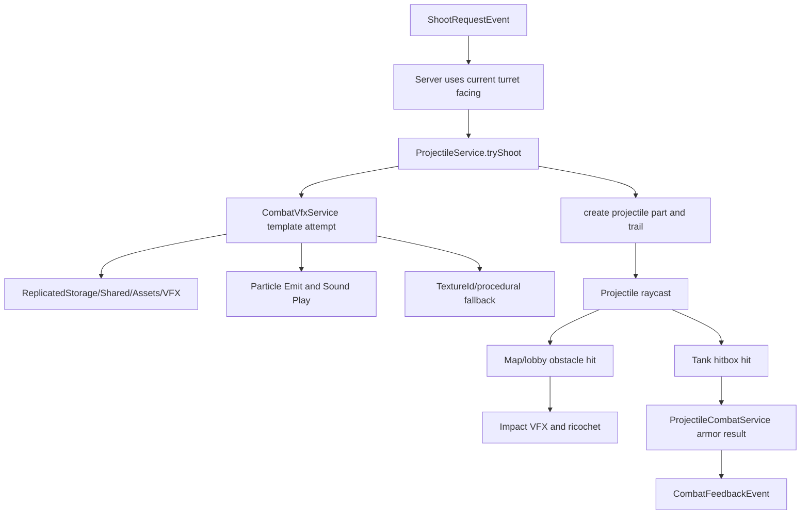
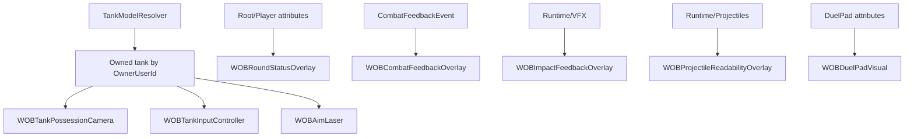

# Architecture Graph

Graphify note: локальный `graphify` бинарь найден, но pipeline не запускался в этом sprint, чтобы не создавать новый `graphify-out` и не раздувать изменения. Архитектурная карта ниже сделана вручную по текущим Rojo/Luau файлам.

## Server Bootstrap Flow

## Lobby Flow

## Tank Participant Flow

## Movement Flow

## Projectile And VFX Flow

## Client Camera Input HUD Flow

## Config Dependencies

- `TankConfig`: movement speed, body turn speed, turret turn speed, shoot facing rule, armor/hitbox layout.
- `WeaponConfig`: primary weapon id, cooldown, projectile type id.
- `ProjectileCatalog`: projectile speed, damage, penetration, ricochet count and lifetime.
- `VfxConfig`: shot sound, projectile visuals, procedural VFX, template names/lifetimes/emit counts.
- `MatchConfig`: series target wins.
- `CameraConfig`, `AimAssistConfig`, `HudConfig`, `ProjectileVisualConfig`: client presentation.

## Scene Contract

- `Workspace/WOB_Generated/Runtime`: runtime projectiles and VFX only.
- `Workspace/WOB_Generated/TestObjects`: physical tank models.
- `Workspace/WOB_Generated/Map`: arena walls, cover, ricochet walls, spawn points.
- `Workspace/WOB_Generated/Lobby`: elevated lobby floor, railings, spawn points, DuelPad.
- `ReplicatedStorage/Shared/Assets/VFX`: source templates for cloned VFX.
- `docs/patches/*_COMMAND.lua`: manual Studio scene repair, always outside Play Mode.
